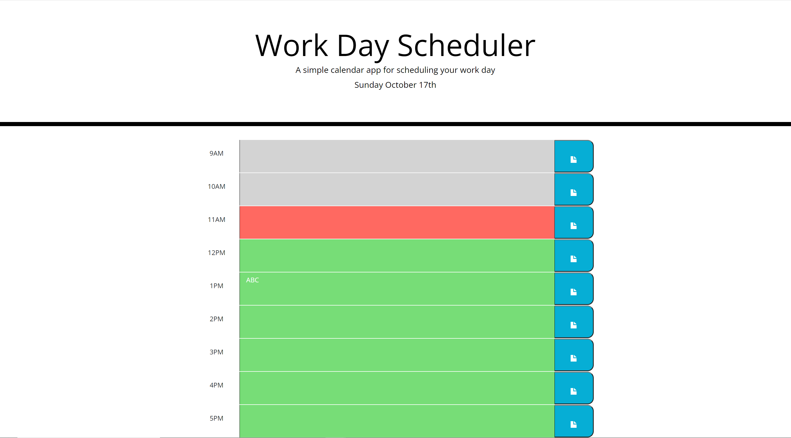
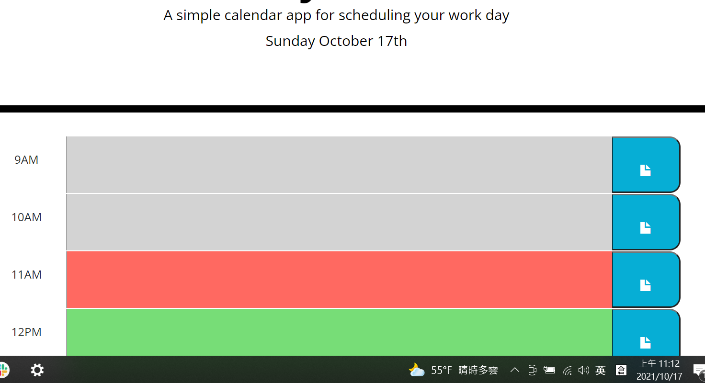
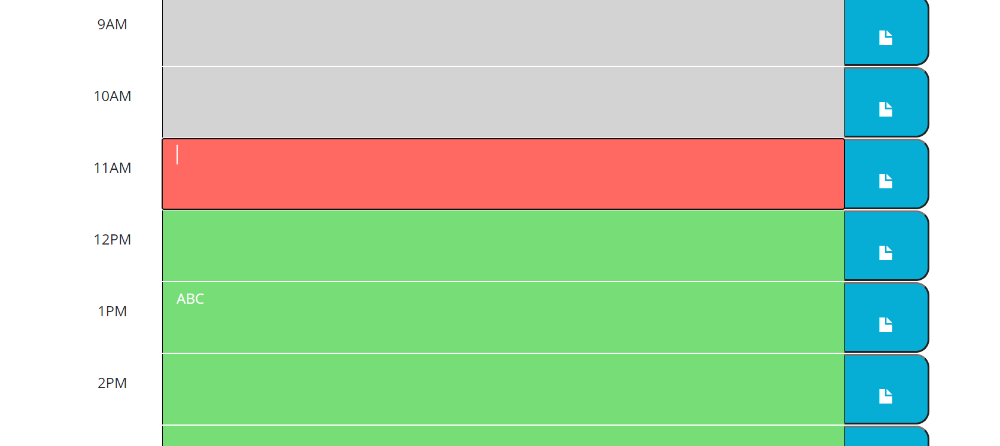
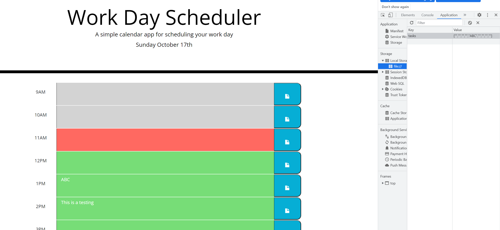
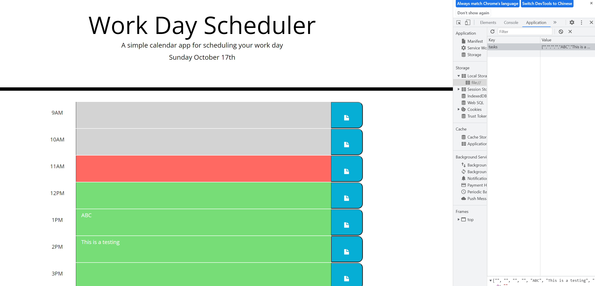

# 05 Third-Party APIs: Work Day Scheduler

Create a simple calendar application that allows the user to save events for each hour of the day. This app will run in the browser and feature dynamically updated HTML and CSS powered by jQuery.

The starter code uses the [Moment.js](https://momentjs.com/) library to work with date and time, but feel free to use a different JavaScript solution to handle this functionality since Moment.js is considered a "legacy" project. Learn more about these other solutions in the [Moment.js project status page.](https://momentjs.com/docs/#/-project-status/)

## User Story

```
AS AN employee with a busy schedule
I WANT to add important events to a daily planner
SO THAT I can manage my time effectively
```

## Acceptance Criteria

```
GIVEN I am using a daily planner to create a schedule
WHEN I open the planner
THEN the current day is displayed at the top of the calendar
WHEN I scroll down
THEN I am presented with timeblocks for standard business hours
WHEN I view the timeblocks for that day
THEN each timeblock is color coded to indicate whether it is in the past, present, or future
WHEN I click into a timeblock
THEN I can enter an event
WHEN I click the save button for that timeblock
THEN the text for that event is saved in local storage
WHEN I refresh the page
THEN the saved events persist
```

The following animation demonstrates the application functionality:


## Review

You are required to submit the following for review:

* The URL of the deployed application.

* The URL of the GitHub repository. Give the repository a unique name and include a README describing the project.

- - -
© 2021 Trilogy Education Services, LLC, a 2U, Inc. brand. Confidential and Proprietary. All Rights Reserved.

## Result

URL of the deployed application : https://pc611652003.github.io/Work-Day-Scheduler/

URL of the GitHub repository : https://github.com/pc611652003/Work-Day-Scheduler

The Application will start at this page with local storage loaded.


The Application will load Today's Date and Color coding according to Current Time.


User can click on the Text Box to Start Edit the Info


After editing, the new info is not stored in the local storage.


After click on the save button, the info is now saved in the local storage.
